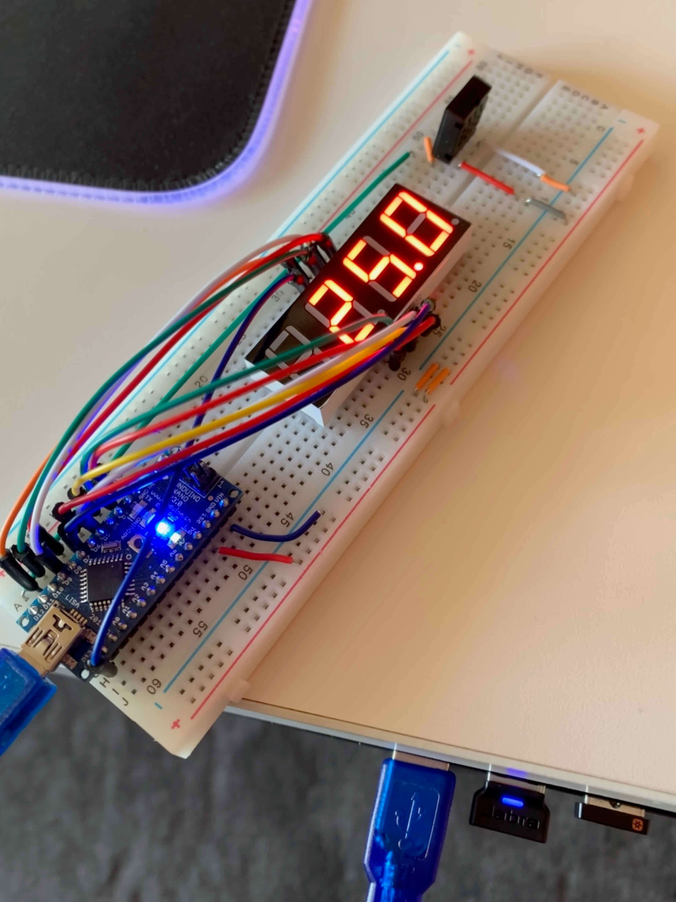

# Arduino Projects
Miscellaneous arduino projects 

1. [Temperature-Display](temperature-display/README.md)
   A board that measures the temperature and displays it on a 4-digit-7-segment display

## Examples
A [temperature display board](temperature-display/README.md):

 