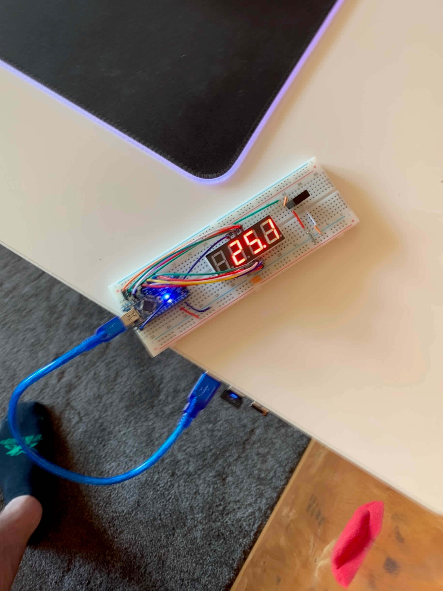
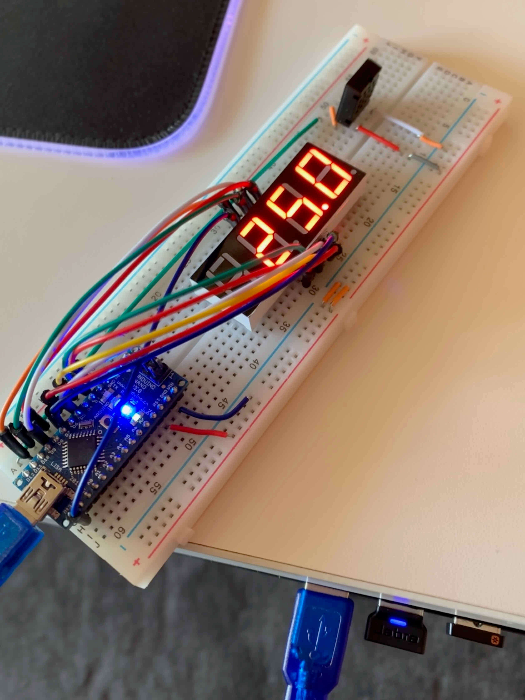
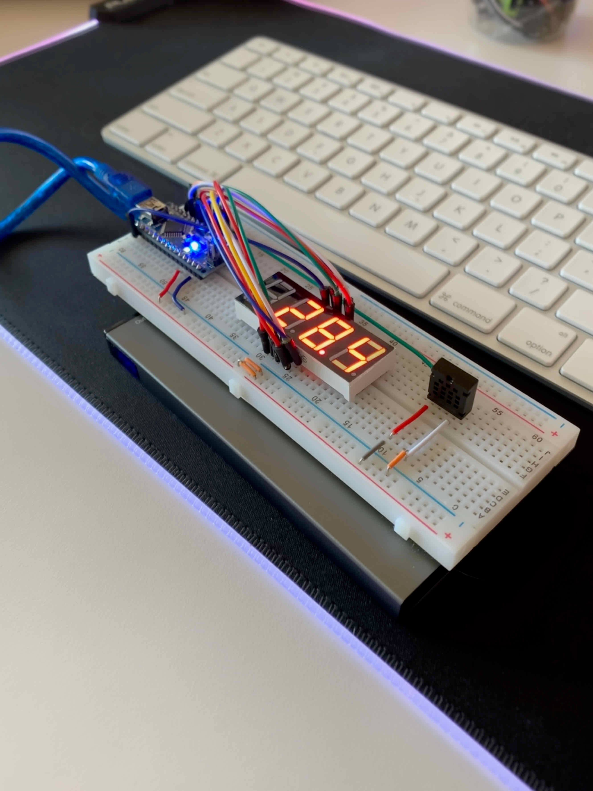
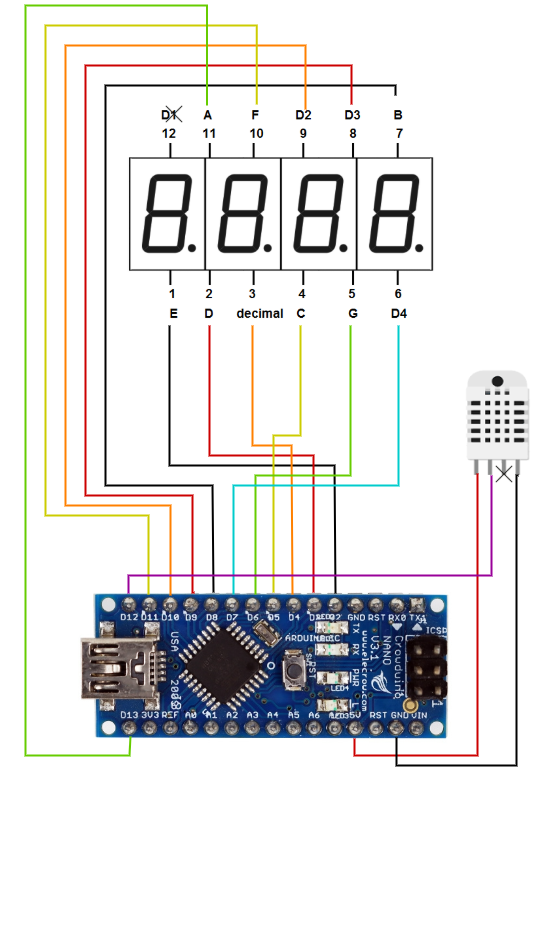

# Temperature Display Board
A board that displays the current temperature

 
 
 

## Hardware
### Components
1. [Arduino Nano V3.0](https://www.aliexpress.com/item/1005001769058585.html)
2. [4 Digit, 7 Segment Display](https://www.sparkfun.com/products/11408)
3. [DHT22 Temperature/Humidity Sensor](https://www.aliexpress.com/item/1005003538280134.html)

### Configuration

## Software
### Libraries to Download
You need to download these libraries through Arduino Studio > Tools > Manage Libraries

1. DHT Sensor Library - Adafruit (v1.4.3)
2. SevSeg - Dean Reading (v3.7.0)

## More info / Resources

* [Arduino Nano Pinout](https://www.makerguides.com/wp-content/uploads/2020/10/arduino-nano-pinout.png)
* [7 Segment Display Pinout](http://www.learningaboutelectronics.com/images/4-digit-7-segment-LED-display-pinout.png)
* [DHT22 Pinout](https://encrypted-tbn0.gstatic.com/images?q=tbn:ANd9GcQU-I-D0zZ2xtMy6QZUaqPc-_V6Ele_lYFsD_RiYXSWsBFZjT-qJQfMt7sWt2a0i73AI1w&usqp=CAU)
* [**TUTORIAL** - 7 Segment Display](https://www.circuitbasics.com/arduino-7-segment-display-tutorial/)